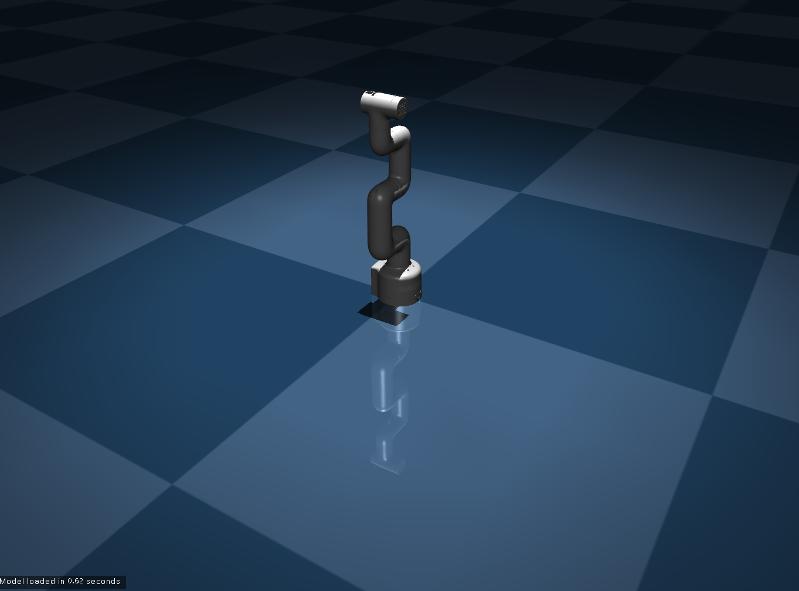

# mujoco_mycobot

mycobot 280 PIをMuJoCoで動作させるためのxmlファイルを作成したディレクトリ.

# 格納されているファイルとフォルダ

- xmlファイル
- stl
<非公式> : `sample.xml`
- **official_model<公式>** : `mycobot_pi.xml` 
[CADデータはここからダウンロード](https://docs.elephantrobotics.com/docs/mecharm-pi-en/4-BasicApplication/4.5-files_download.html)

# xmlファイルをMuJoCoに導入

   

上記画像のようになる.

## おまけ

C++でmycobotをMuJoCo内で動作させるプログラムを作成した. 
[mujoco_sample](https://github.com/kaitoyamazaki/mujoco_sample)を参考に環境構築をすると動作可能.